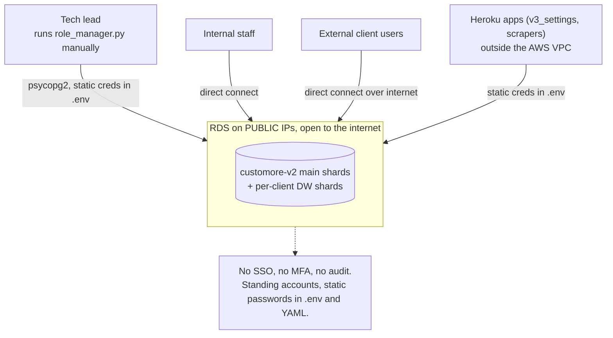
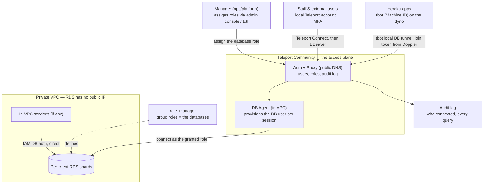
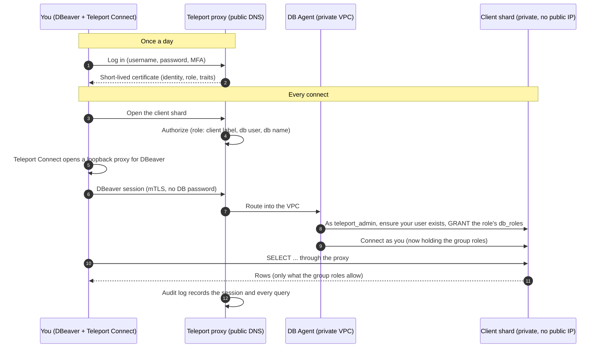
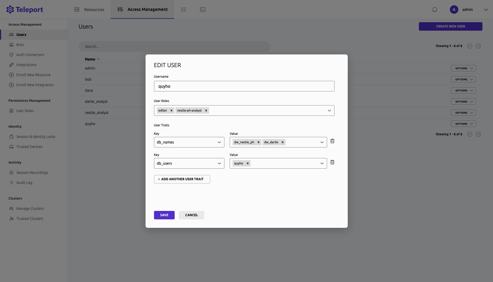
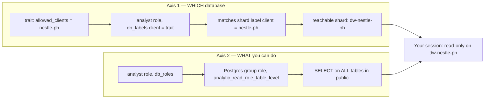
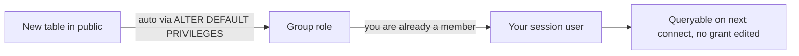

# Users Access Management Enhancement

## 1. Initiatives

Our RDS shards sit on public IPs, authenticated by static passwords in `.env` and YAML, with no
record of who connects or what they run. This initiative puts every shard behind one
identity-aware access plane on self-hosted Teleport Community and moves RDS fully private. The
goals: close the public exposure, replace shared passwords with per-person short-lived
certificates, log every session and query, scope each person to only the client shard they were
granted, and serve internal staff, external client users, and our Heroku apps through the same
plane. It stays cheap (free Community license, no VPN). Per-client shards, version-controlled
roles, and dry-run apply are unchanged.

---

## 2. Current state architecture

Everything authenticates with a long-lived password that lives in plaintext config, anyone with
the string and the public endpoint is in, and nothing is recorded.

---

## 3. Target architecture

One plane. Teleport (auth + proxy) is the only way in. RDS has no public IP. The DB agent runs
inside the VPC and is the only thing that talks to the shards directly.

Key points:

- **The Teleport proxy stays public on purpose.** It is the secure front door. Everything behind
  it goes private. RDS security groups allow only the DB agent's security group.
- **Humans** log in through the Teleport Connect desktop app and query from DBeaver over a local
  proxy. They never hold a DB password; the certificate is their identity.
- **Heroku apps** run `tbot` on the dyno, which opens a local Postgres tunnel. The app's
  `DATABASE_URL` points at `localhost`, no app code change beyond the connection string. The join
  token is delivered through Doppler (already in our stack) and rotates, so no long-lived secret
  anywhere.
- **The agent provisions the Postgres user on the fly** as `teleport_admin`, grants it the group
  roles the person's Teleport role names, then connects as that user.

---

## 4. How each actor connects

| Actor | Path | Auth | Scope |
|---|---|---|---|
| **Staff** | Teleport Connect app → DBeaver on a local proxy | Local Teleport account + MFA, short-lived cert | The shards the manager granted |
| **External client user** | same | Local Teleport account + MFA | The one client shard granted |
| **Heroku app (machine)** | `tbot` local DB tunnel → public proxy → in-VPC agent | Machine ID cert, join token via Doppler | The shards its bot identity was granted |
| **Teleport DB agent** | Inside the VPC | mTLS / IAM as per-shard `teleport_admin` | Provisions the session user with the granted role |
| **In-VPC service** (if any) | Direct, no Teleport | IAM DB auth via its task role | Its own database |

### End-to-end diagram:

---

## 5. User and role management

**Lifecycle (manual, tied to the joiner/leaver process):**

| Step | Action |
|---|---|
| Onboard | Ops creates the account: `tctl users add` (staff and external alike), MFA enrolled on first login. Baseline = no DB access. |
| Revoke | Manager removes the role. To cut an active session instantly: `tctl lock`. |
| Offboard | `tctl lock` (instant "access denied") then `tctl users rm`. |
| Review | Periodic access reviews, since there is no IdP to sync from. |

**How a grant becomes table access (two independent axes):**

Traits and labels pick *which* database, `db_roles` pick *what* you can do. Add a client by
adding it to the person's `allowed_clients` trait; make them read-write by adding a write group
role. The two never tangle, so **one templated `analyst` role covers everyone**. Onboarding a new
client adds zero Teleport roles.

**`role_manager` becomes group-roles-only.** It keeps `CREATE ROLE` and the privilege grants for
the group roles (`analytic_*`, `product_*`, `tech_*`, `read_dw_*`) plus the per-shard
`teleport_admin` the agent uses. It drops `CREATE USER`, per-user grants, and passwords. Two
tiers: a coarse analytics tier (`databases: [ALL]`, all tables in `public`) that is shard- and
table-count independent, and a fine per-client tier for subset access. `ALTER DEFAULT PRIVILEGES`
keeps new tables readable without editing any role.

Note: `tables: [ALL]` makes `public` the trust boundary. Hold sensitive tables in a separate
schema or in `except_tables`.

---

## 6. Next steps

Ordered so nothing breaks during the cutover (register and test through Teleport while RDS is
still public, then flip it private last).

1. **Inventory** every shard, group role, and current user.
2. **Stand up the Teleport cluster** (single node to start, HA later). Create a local account per
   person, no DB access yet, turn on Teleport MFA.
3. **Run the DB Agent in the VPC**, register every shard with `teleport_admin` and
   auto-provisioning, **while RDS is still public**.
4. **Convert `role_manager`** to group-roles-only, add `teleport_admin`, apply.
5. **Cut humans over.** Grant one person a shard end to end, connect via Teleport Connect, confirm
   the audit log. Then roll across staff and external users.
6. **Get one Heroku app on Machine ID.** `tbot` on the dyno, join token via Doppler, app
   `DATABASE_URL` → local tunnel. Verify against the still-public shard.
7. **Flip private.** Set `PubliclyAccessible = false`, move to private subnets, lock security
   groups to the agent's SG only.
8. **Remove the old standing accounts** and strip `.env`/YAML passwords. Keep a restricted
   break-glass path straight to RDS over IAM for emergencies.

### Cost

Teleport Community license is free. Recurring: the node(s) running auth and proxy, the audit and
session backend (S3 + DynamoDB), a NAT gateway, and a public DNS name with a TLS certificate. No
VPN, no per-user access license.
